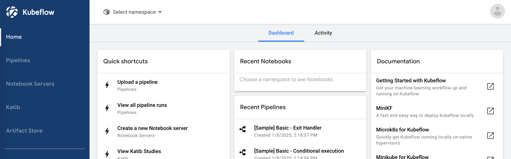
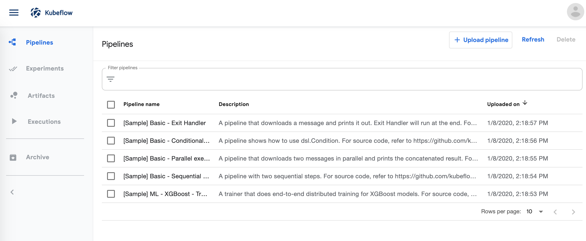
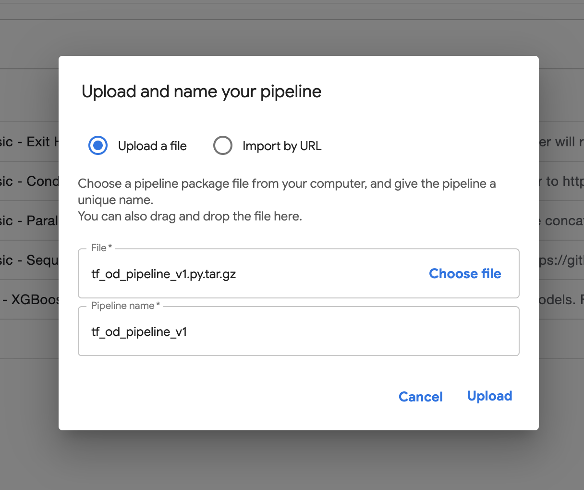

# Tutorial: Kubeflow Pipelines + TF's Object Detection API

## Scope and Goal
This tutorial walks through how to train an object detection model with TF's Object Detection API and Kubeflow (KF) Pipelines. The end goal is a fast and highly reusable pipeline that should work for any standard object detection or instance segmentation problem.

* [TF's OD API](https://github.com/tensorflow/models/tree/master/research/object_detection) is a toolbox for training/running many different popular object detection models. 
* [Kubeflow](https://www.kubeflow.org/) is a set of ML-relevant tools built on top of the [Kubernetes](https://kubernetes.io/) (k8s) container orchestration platform. KF is an umbrella project with many different subprojects (e.g., Pipelines, Katib, KFServing, etc.) focused on making ML on the cloud easier.
* [KF Pipelines](https://www.kubeflow.org/docs/pipelines/) is one subproject within KF focused on automating and tracking end-to-end ML workflows.

This guide assumes you have object detection training data and some familiarity with setting a Kubernetes cluster with KF.

## Overview
The major sections will be broken down as follows:
1. Basics of KF Pipelines
1. Set up KF on a cluster
1. Build and upload a KF pipeline
1. Start/monitor KubeFlow pipeline run
1. Examine results saved to a cloud bucket

**Disclaimer**: All of the tools used here are in high-speed development. The TF and KF documentation sites will be your best source of info to keep to date with new features and workflows. KF's documentation is generally good/current.

## 1. Basics of KF Pipelines
Read through the [Pipelines Overview](https://www.kubeflow.org/docs/pipelines/overview/pipelines-overview/). Make sure you understand:
* [components](https://www.kubeflow.org/docs/pipelines/overview/concepts/component/) -- the containerized "steps" within a pipeline
* [output "artifacts"](https://www.kubeflow.org/docs/pipelines/overview/concepts/output-artifact/) -- output files/strings from each component
* [experiments](https://www.kubeflow.org/docs/pipelines/overview/concepts/experiment/) and [runs](https://www.kubeflow.org/docs/pipelines/overview/concepts/run/) -- the language/concepts around ML trials

After reviewing the building blocks, check out this [excellent quick-start guide](https://www.kubeflow.org/docs/pipelines/pipelines-quickstart/) to get a feel for the UI and step-by-step usage. There are many images showing the results of each step, so you don't necessarily have to run it.

## Set up KF on a Kubernetes cluster
The easiest way to use KF Pipelines is to setup a vanilla KF deployment since the Pipelines tool is installed default. To do this, you need to (1) set up a k8s cluster and then (2) deploy KubeFlow to that cluster. There are a number of KF deployment guides for the major cloud platforms on the [head doc page](https://www.kubeflow.org/docs/). 

To deploy on GCP, you can use `kfctl` command line tool described in [this guide](https://www.kubeflow.org/docs/gke/deploy/deploy-cli/). Once you have setup GCP credentials, you can both create the k8s cluster and deploy KF with the same tool. This project's [README](../README.md) document has the relevant code for deploying KF in this manner.

Then open up the Kubeflow UI by looking in GKE > Services & Ingress. It should be something like `https://kubeflow-app-vX.endpoints.divot-detect.cloud.goog/`. Note that the  take 5-10 minutes to come online _after_ the cluster is completely ready (so be patient if you're getting `This site can’t be reached` or `This site can’t provide a secure connection` messages). When it's working, you should see the UI landing page like this:


## Build and upload a KF Pipeline

### Primer on the pipeline creation script
The python code to create the KF pipeline is in [../pipelines](../pipelines). This pipeline build script does a few things:
* Define which components we will use and where to load them from. Here, we load custom ones from the `components` directory. However, you can also load remote ones via a URL. In addition to looking at the components defined here, KF has docs on [creating your own components](https://www.kubeflow.org/docs/pipelines/sdk/component-development/). 
* Defines the overall pipeline object/function (using the `@dsl.pipeline` decorator).
* Within the pipeline, define all the inputs to the components and the order in which they run.
* Define the resource limits or other specifications for each component.

### Compile the pipeline

First compile the OD training image component Dockerfile/upload it to GCS with this image build script
```bash
./components/od_train/build_image.sh
```

We don't need to build the exporter image, because it'll reuse the training image we just compiled.

Now, we'll build the pipeline itself. The KF Pipelines UI accepts `.zip` versions of the pipeline. Create it by simply running `python tf_od_pipeline_v1.py`. You should see `tf_od_pipeline_v1.py.tar.gz` appear in the same directory.

### Upload they pipeline to KF via the UI
Click the `+ Upload pipeline` button on this page:


Enter your local path here and upload it:


## Start/monitor KubeFlow pipeline run

### Starting a run
Now that you have your pipeline uploaded, create an experiment, and `+ Create a Run`. 

Reasonable defaults/examples for pipeline parameters:

| Parameter  | Example | Description |
| ------------- | ------------- | ------------- |
| pipeline_config_path | `gs://divot-detect/model_dev/model_templates/mask_rcnn_coco_v1.config` | TF OD API config file |
| model_dir | `gs://divot-detect/experiments/4` | Directory to store checkpoints |
| eval_dir | `gs://divot-detect/experiments/4/eval_0` | Directory to store validation results |
| inference_output_directory | `gs://divot-detect/experiments/4/best_eval` | Directory to export the best checkpoint to (for TF Serving) after training completes |
| num_train_steps | `200000` | Total train steps (as in TF OD API config) |
| sample_1_of_n_eval_examples | `1` | Proportion of validation data to use (1/n; as in TF OD API config) |
| inference_input_type | `encoded_image_string_tensor` | Format of input in exported model |
| eval_checkpoint_metric | `loss` | Name of metric to use during validation |
| metric_objective_type | `min` | Used in conjunction with `eval_checkpoint_metric` when selecting best model. `min` or `max` |

### Monitor a run
Check the status of any component by viewing its box within the graph dashboard. Click on the box to view extra details:
* Artifacts -- any graphs or tables generated from that component
* Input/Output -- nominal input parameters and the expected output
* Logs -- k8s container logs for completed/running components

### Examine results in the cloud bucket
* Model home directory (specified in `model_dir`)
    * All TF OD API model checkpoints
    * TFEvents file with training results (view with TensorBoard)
* Evaluation directory with validation results (specified in `eval_dir` folder)
    * TFEvents file with validation results (view with TensorBoard)
* Exported model (ready to be dropped into a TFServing Docker image; specified in `best_eval` folder)